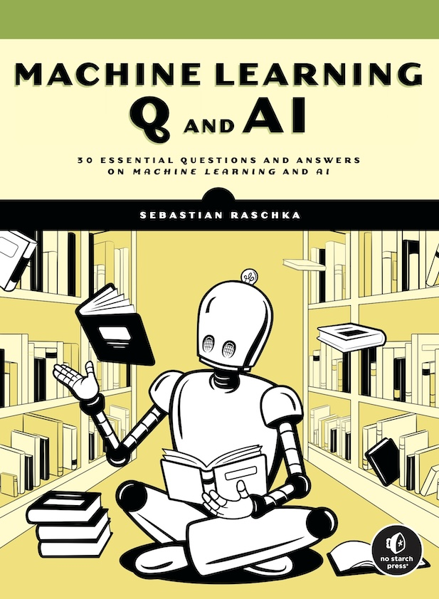

# *Machine Learning Q and AI Beyond the Basics* Book

이 저장소는 Sebastian Raschka가 쓴 [Machine Learning Q and AI](https://nostarch.com/machine-learning-q-and-ai)의 번역서를 위한 코드 예제를 담고 있습니다.

이 책에 궁금한 점이 있다면 [텐서 플로우 블로그](https://tensorflow.blog/ml-q-and-ai)에 글을 남겨 주세요!

#### 이 책에 대하여

머신 러닝과 AI 기초에 대해 알고 있고 전문가로 가기 위한 지식의 간극을 채우고 싶다면 이 책이 딱입니다. 각 장은 짧고 간결하게 구성되어 있고 이 분야에서 핵심적인 30개의 질문을 다룹니다. 여러분의 작업에 최신 기술을 적용하는데 도움이 될 것입니다.

*Machine Learning Q and AI*의 각 장은 중요한 질문에 대한 답을 담고 있습니다. 새로운 개념을 설명할 때 다이어그램을 사용하고 추가적인 읽을 거리를 위해 참고 자료를 제공합니다.

- 다중 GPU 훈련 패러다임
- 트랜스포머 미세 튜닝
- 인코더 기반 LLM과 디코더 기반 LLM의 차이점
- 비전 트랜스포머 이면의 개념
- ML을 위한 신뢰 구간
- 등등!

#### 리뷰

> “과장하지 않고 현재 이 분야에서 가장 뛰어난 머신 러닝 교육자인 세바스찬보다 더 잘 설명하기는 어렵습니다. 매 페이지마다 세바스찬은 폭넓은 지식을 전수할 뿐만 아니라 진정한 전문성이 드러나는 열정과 호기심도 엿볼 수 있습니다.” 
**-- 크리스 앨본(Chris Albon), 위키미디어 재단의 머신러닝 디렉터**

#### 링크

- [Yes24]()
- [한빛미디어]()
- [깃허브](https://github.com/rickiepark/MLQandAI)

 

## 목차

| 장 | 목차 | 예제 코드 |
|---------|-------|----------|
|| PART I: 신경망과 딥러닝 | |
| 1 | 임베딩, 잠재 공간, 표현 | |
| 2 | 자기 지도 학습 | |
| 3 | 퓨-샷 학습 | |
| 4 | 로터리 티켓 가설 | |
| 5 | 데이터로 과대적합 줄이기 | |
| 6 | 모델을 변경하여 과대적합 줄이기 | |
| 7 | 다중 GPU 훈련 패러다임 | |
| 8 | 트랜스포머의 성공 | |
| 9 | 생성 AI 모델 | |
| 10 | 무작위성의 원인 | [data-sampling.ipynb](supplementary/q10-random-sources/data-sampling.ipynb)   [dropout.ipynb](supplementary/q10-random-sources/dropout.ipynb)    [random-weights.ipynb](supplementary/q10-random-sources/random-weights.ipynb)|
|| PART II: 컴퓨터 비전 | |
| 11 | 파라미터 개수 | [conv-size.ipynb](supplementary/q11-conv-size/q11-conv-size.ipynb)|
| 12 | 완전 연결 층과 합성곱 층 | [fc-cnn-equivalence.ipynb](supplementary/q12-fc-cnn-equivalence/q12-fc-cnn-equivalence.ipynb)|
| 13 | 비전 트랜스포머를 위한 대규모 훈련 세트 | |
|| PART III: 자연어 처리 | |
| 14 | 분포 가설 | |
| 15 | 텍스트 데이터 증식 | [backtranslation.ipynb](supplementary/q15-text-augment/backtranslation.ipynb)   [noise-injection.ipynb](supplementary/q15-text-augment/noise-injection.ipynb)   [sentence-order-shuffling.ipynb](supplementary/q15-text-augment/sentence-order-shuffling.ipynb)   [synonym-replacement.ipynb](supplementary/q15-text-augment/synonym-replacement.ipynb)   [synthetic-data.ipynb](supplementary/q15-text-augment/synthetic-data.ipynb)   [word-deletion.ipynb](supplementary/q15-text-augment/word-deletion.ipynb)   [word-position-swapping.ipynb](supplementary/q15-text-augment/word-position-swapping.ipynb)|
| 16 | 셀프 어텐션 | |
| 17 | 인코더 기반 트랜스포머와 디코더 기반 트랜스포머 | |
| 18 | 사전 훈련된 트랜스포머 모델의 사용과 미세 튜닝 방법 | |
| 19 | 생성형 대규모 언어 모델의 평가 | [BERTScore.ipynb](supplementary/q19-evaluation-llms/BERTScore.ipynb)   [bleu.ipynb](supplementary/q19-evaluation-llms/bleu.ipynb)   [perplexity.ipynb](supplementary/q19-evaluation-llms/perplexity.ipynb)   [rouge.ipynb](supplementary/q19-evaluation-llms/rouge.ipynb) |
|| PART IV: 제품화와 배포 | |
| 20 | 상태 비저장 훈련과 상태 저장 훈련 | |
| 21 | 데이터 중심 AI | |
| 22 | 추론 속도 높이기 | |
| 23 | 데이터 분포 변화 | |
| | PART V: 예측 성능과 모델 평가 | |
| 24 | 푸아송 회귀와 서열 회귀 | |
| 25 | 신뢰 구간 | [four-methods.ipynb](supplementary/q25_confidence-intervals/1_four-methods.ipynb)   [four-methods-vs-true-value.ipynb](supplementary/q25_confidence-intervals/2_four-methods-vs-true-value.ipynb)|
| 26 | 신뢰 구간 vs. 컨포멀 예측 | [conformal_prediction.ipynb](supplementary/q26_conformal-prediction/conformal_prediction.ipynb) |
| 27 | 적절한 측정 지표 | |
| 28 | k-폴드 교차 검증의 k | |
| 29 | 훈련 세트와 테스트 세트 불일치 | |
| 30 | 제한적인 레이블 데이터 | |
